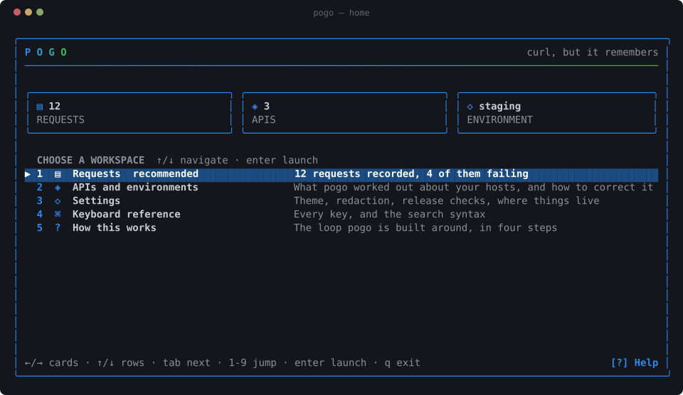
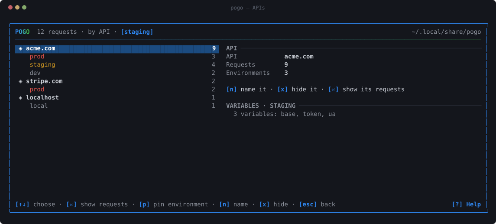
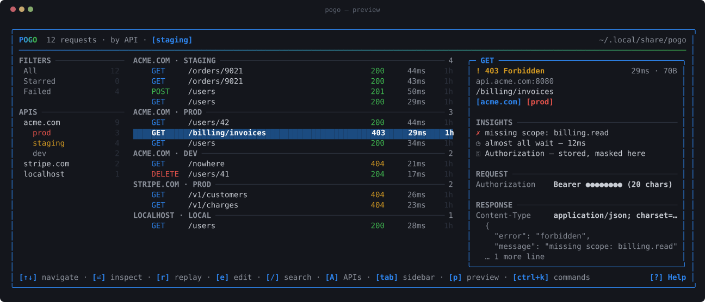
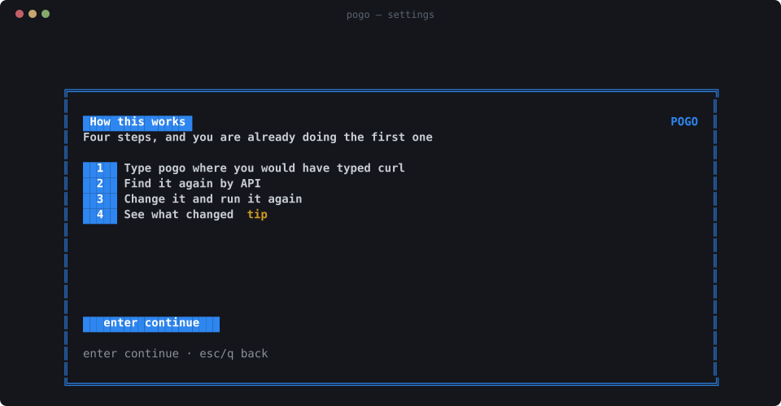

<div align="center">


**Type `pogo` where you would have typed `curl`. It keeps the answer.**

[Website](https://rmpato.github.io/pogo) · [Docs](docs/) · [Keys](docs/keybindings.md) · [APIs](docs/apis.md) · [Security](docs/security.md)

[](https://github.com/rmpato/pogo/actions/workflows/ci.yml)
[](https://pkg.go.dev/github.com/rmpato/pogo/cmd/pogo)
[](LICENSE)


</div>

---

**`pogo`** is curl with a memory. Give it a request and it hands your arguments
to the real curl binary — same flags, same output, same exit code — and writes
down what happened. Run it bare and you get a terminal UI over everything it has
recorded: find a request, inspect it, replay it, change it and run it again,
compare two responses.

One binary. curl does the requesting; pogo does the remembering.

Your shell remembers the *command*. It does not remember the response, the
status, how long it took, or which of the six nearly identical `curl` lines in
your history was the one that worked.

## Quickstart

```bash
# 1. install (needs curl, which you already have)
curl -fsSL https://raw.githubusercontent.com/rmpato/pogo/main/install.sh | sh

# 2. make a request, exactly as curl would
pogo curl https://api.github.com/zen

# 3. open everything you have run
pogo
```


Then press `ctrl+k`. Everything pogo can do is there, searchable by name, with
each command's key beside it — so you learn the shortcuts by using it and stop
needing the palette.

Or go straight to it: `↑↓` move, `⏎` inspects, `r` replays, `e` edits and runs,
`/` searches, `d` diffs two responses, `A` opens your APIs.

You never saved anything. You never named a collection. It was just there.


<details>
<summary>Other ways to install</summary>

```bash
go install github.com/rmpato/pogo/cmd/pogo@latest
```

```bash
git clone https://github.com/rmpato/pogo && cd pogo && make install
```

Update later with `pogo update`. macOS and Linux, and `curl` is the only runtime
dependency.

</details>

## The whole command line

```bash
pogo                          # the UI, over everything you have run
pogo curl -sS https://…       # wrap curl and record it
pogo https://api.acme.com/me  # the same thing, without typing curl
pogo list --json | jq         # history, for a script to read
pogo api                      # show and correct how requests are grouped
pogo env                      # the variables requests resolve against
pogo import-har out.har       # bring in what the browser did
```

pogo's own options on a request live behind a `--pogo-` prefix, so no curl
option — present or future — can ever collide with one:

```bash
pogo curl --pogo-note 'the one that worked' --pogo-env staging https://…
```

`H` from anywhere in the UI opens the shell above it — the workspaces that are
not the list, and the walkthrough you were shown on your first run.



## What you get

### One API, however many hosts it has

`api.acme.com`, `api.staging.acme.com` and `dev-api.acme.com` are not three
unrelated servers. They are one API in three environments, and a history that
lists them as three hosts has thrown away the only fact that made it navigable.

So pogo groups by the registrable domain and reads the environment out of what
is left. Nothing to configure: it is true of your history the first time you
open it.



Both are guesses, and a guess that cannot be corrected is worse than none — so
every one of them is overridable, from the UI (`A`) or the command line, and an
override wins from then on, backwards through history as well as forwards:

```bash
pogo api pin api-2.acme.com staging   # stop guessing, it is staging
pogo api move localhost:3000 acme.com # this is our API, running locally
pogo api name acme.com Acme           # call it what you call it
```

→ [APIs, environments, collections and HAR import](docs/apis.md)

### Find it

The sidebar shows what is actually in your history — filters, APIs and their
environments, collections — with counts. `tab` focuses it, `⏎` filters by a row,
and the search box then shows the query it ran, which is how the syntax gets
learned without reading anything.


Or type it directly with `/`: free text, or `api:acme.com`, `env:staging`,
`method:POST`, `status:4xx`, `host:api.acme.com`, `collection:auth`,
`is:starred`, `is:failed`. `t` cycles grouping — by API, chronological, by host,
by collection.

### Preview it before you open it

The panel down the right is the request under the cursor: where it went, what
it carried, what came back — and the things worth knowing before you act. Why
it failed, in the API's own words. How often this endpoint has been called and
how many of those failed. Where the time went. `p` hides it.



### Read it

Request and response, headers, query parameters, bodies, with a JSON tree you
can fold and secrets masked until you ask (`S`).


### Change it and run it

`e` opens the request as fields. `ctrl+r` runs it as a **new** entry; the
original is never touched.


Edits are applied to your original command rather than regenerating one, so a
request carrying `--cacert`, `--resolve` or `-k` keeps every one of those
options when you change a header.

### See what changed

Replay something and press `d`: the request you replayed is already marked, so
"what changed?" is one keystroke rather than four. JSON-aware — reordered keys
and reformatted whitespace are not differences, changed values are — and
response headers are diffed too.


### See where the time went

Straight from curl's own instrumentation. Nothing is estimated; if your curl
cannot report it, pogo says so.


### Keep secrets out of your history

An environment *name* is global — "staging" means the same word everywhere — but
its values belong to one API. So `{{base}}` is acme's staging host for an acme
request and the payments team's for a payments one, and neither has to be called
`acme_staging_base`:

```bash
pogo env set staging --api acme.com base=https://api.staging.acme.com
pogo env set staging --api acme.com token=sk_test_9f2b1c
pogo env use staging

pogo curl -H "Authorization: Bearer {{token}}" '{{base}}/users/42'
```

curl gets the token. `history.jsonl` gets `{{token}}`. A replay months later
resolves it again — against whatever the variable holds *then*. `E` switches
environment, so you can replay the same request against staging and production
and `d` the results.

→ [Environments and variables](docs/apis.md)

## Why not just shell history?

```bash
history | grep curl
```

finds the command you typed. It does not tell you:

| | shell history | pogo |
|---|---|---|
| the command | ✅ | ✅ |
| what came back | ❌ | ✅ |
| status code | ❌ | ✅ |
| how long it took | ❌ | ✅ |
| where the time went | ❌ | ✅ |
| which API and environment | ❌ | ✅ |
| search by status, API or collection | ❌ | ✅ |
| replay | retype it | `r` |
| edit and replay | retype it | `e` |
| compare two responses | ❌ | `d` |

pogo is HTTP-aware history for your terminal. That is all it is trying to be.

## Storage and security

History lives in `~/.local/share/pogo` as append-only JSONL plus payload files.
Directory `0700`, files `0600`, nothing encrypted. Your requests never leave the
machine.

> [!IMPORTANT]
> **Request headers routinely carry credentials, and by default pogo stores them
> as sent.** Your history file will contain bearer tokens, cookies and API keys
> in plain text. That is a trade-off, not an accident: stripping them would make
> replay silently fail to authenticate. pogo masks secrets on screen; the file on
> disk holds the real thing.

Three ways to change that, in increasing order of strength:

```bash
POGO_REDACT=store pogo curl ...                                # strip secrets before writing
pogo curl --pogo-no-capture ...                                # do not record this one
pogo curl -H "Authorization: Bearer {{token}}" '{{base}}/me'   # never capture it at all
```



Every setting is written on the keypress that changes it. There is no save key,
because there is no unsaved state to get wrong.

→ [What is stored, what it exposes, and how to change it](docs/security.md)

## Documentation

| | |
|---|---|
| [docs/keybindings.md](docs/keybindings.md) | Every key, and the search syntax |
| [docs/apis.md](docs/apis.md) | APIs, environments, variables, collections, HAR import |
| [docs/security.md](docs/security.md) | What lands on disk and how to control it |
| [docs/architecture.md](docs/architecture.md) | How pogo wraps curl without changing it |
| [docs/runbooks/](docs/runbooks/) | Releasing, screenshots, triage, recovery |
| [CONTRIBUTING.md](CONTRIBUTING.md) | Building, testing, and the three rules |

## How it works, briefly

```
   pogo curl <args> ──▶ curlargs ──▶ runner ──▶ the real curl
                        (metadata)   (execute + capture)
                                        │
                                     capture ──▶ store  (JSONL + blobs, local)
                                        ▲          │
                                        │          ▼
                        the UI replays ─┘         tui ──▶ apis
                                                          (which API? which env?)
```

The UI and the wrapper share one execution path, so a replay is the same code
running the same argv — not a reconstruction of it. Storage knows nothing about
the UI, the UI never touches the filesystem, and the curl layer is testable
without a network.

Go, [Cobra](https://github.com/spf13/cobra),
[Bubble Tea](https://github.com/charmbracelet/bubbletea) and
[Lip Gloss](https://github.com/charmbracelet/lipgloss), built on
[whis](https://github.com/rmpato/whis) — the design system every screen is
composed from, vendored into `internal/ui` and `internal/home` as source we own.
No database, no cgo, no daemon. Everything but `cmd/pogo` lives under
`internal/` deliberately: pogo is a tool, not a library.

→ [Architecture, including the two curl behaviors pogo has to restore](docs/architecture.md)

## Development

```bash
make          # build ./bin/pogo
make check    # gofmt, vet, test, race — the same gates CI runs
make help     # everything else
```

Tests run the real curl against local `httptest` servers; nothing touches the
public internet. Every screen is asserted to render as exactly the terminal's
rectangle at nine sizes, because a frame one row short does not shift — it
leaves the previous frame's row on screen. Start with
[CONTRIBUTING.md](CONTRIBUTING.md).

## Roadmap

The goal everything below serves:

> **You type `pogo` where you type `curl`, and nothing changes.** Then you open
> it and it teaches you itself — reading the docs is for advanced use, not for
> getting started.

Shipped: one binary · APIs and environments as the shape of history · a
structured request editor · collections and grouping · `{{variables}}` scoped
per API · HAR import · response header diffing · per-host redaction rules · a
command palette, sidebar and first-run walkthrough.

Ideas, not promises, ordered by how soon a new user hits the gap.

### Finish the drop-in promise

pogo matches curl on the things that matter to a script — exit codes, `-w`
output, stdout and stderr byte for byte, every flag. What is left is the shell
habit itself: `alias curl='pogo curl'` works, but nothing ships it, and a
toolchain that shells out to `curl --version` still gets curl. An opt-in shim
(`pogo shell-init`) that installs the alias and forwards `--version` and
`--help` to curl would make the substitution total.

### Suggest the next step, not just the last result

After an edit-and-run, or a 401, or a first search that found nothing, there is
usually one obvious thing to do next and nothing says so.

### Autocomplete that learns from your own history

You retype `Content-Type: application/json` a hundred times a week, and you
cannot remember whether that internal header is `X-Acme-Signature` or
`X-ACME-Sig`. pogo already knows: it has watched you send both.

- Header **names** from the ones you have actually used, ranked by recency.
- Header **values** per name — `application/json` for `Content-Type`, the hosts
  you have hit for `Host`.
- **Never** a value for a sensitive header. Suggesting a real bearer token would
  undo the point of [keeping them out of history](docs/apis.md); the suggestion
  is `Bearer {{token}}` instead.
- `{{variables}}` from the active environment, so a wrong name surfaces while
  typing rather than after a 401.
- In the search bar: filter keys, then their values — your APIs, your
  collections, the status codes you have actually seen.

### Postman import and export

The people who would most like pogo are the ones with a Postman collection they
inherited and do not enjoy opening.

- **Import** a collection (v2.1): folders become collections, requests become
  history entries you can inspect, edit and replay like anything else.
- **Import** a Postman environment export straight into `environments.yaml` —
  the syntaxes already agree, since Postman spells variables `{{token}}` too.
- **Export** a pogo collection back out, so handing work to a colleague who
  lives in Postman does not mean retyping it.

Same shape as the [HAR importer](docs/apis.md), which is the proof the seam
works.

### Group by endpoint, not just by API

`/users/42`, `/users/43` and `/users/44` are one endpoint and three rows. At a
few hundred requests they are thirty rows and the shape of your traffic is
invisible.

- Normalize path segments that look like identifiers — numeric, UUID, long hex —
  into `/users/:id`.
- A grouping level below the API, with the count and the mix of statuses.
- Which turns "this endpoint started 500ing at 14:20" into something you see
  rather than something you search for.

### Further out

- export a collection as a runnable script
- chained requests: use a value from one response in the next
- a `--diff` flag for comparing responses in CI
- response body search, which needs an index
- size and timing trends per endpoint and per environment
- a per-project config, so a repo carries its own environments

An issue describing the moment you wanted something beats a feature request.

## License

MIT — see [LICENSE](LICENSE).
