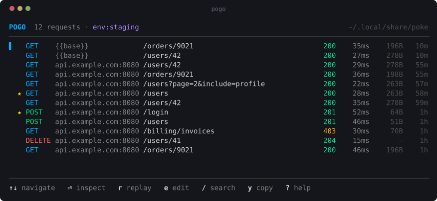
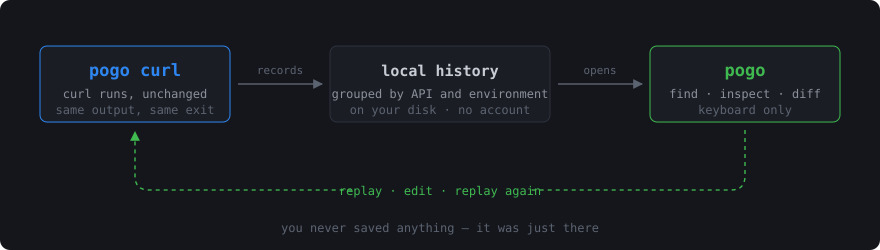
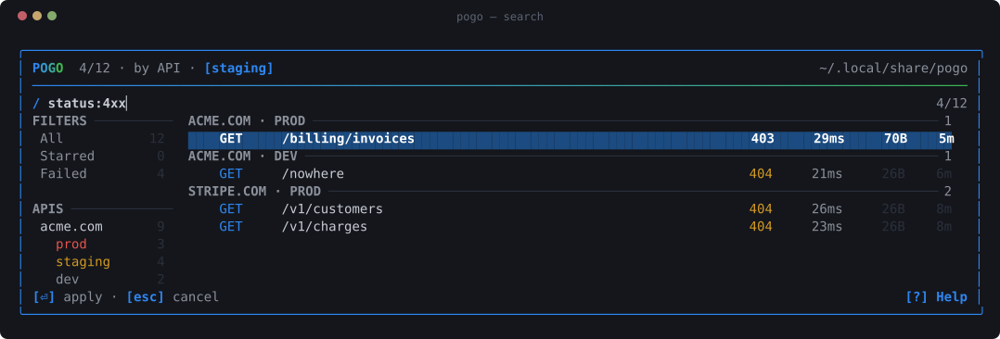
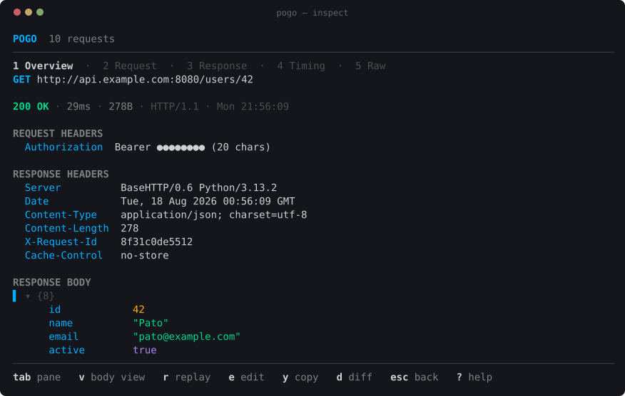
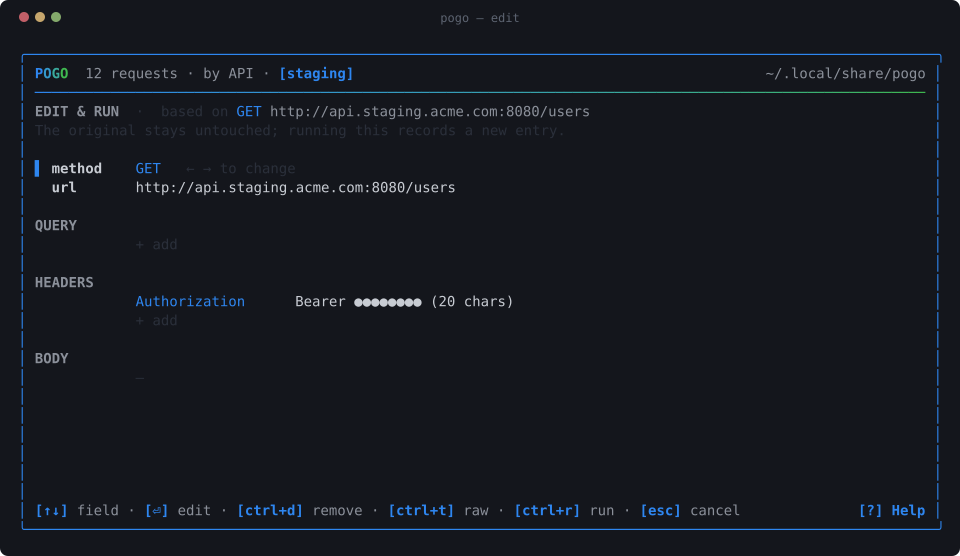
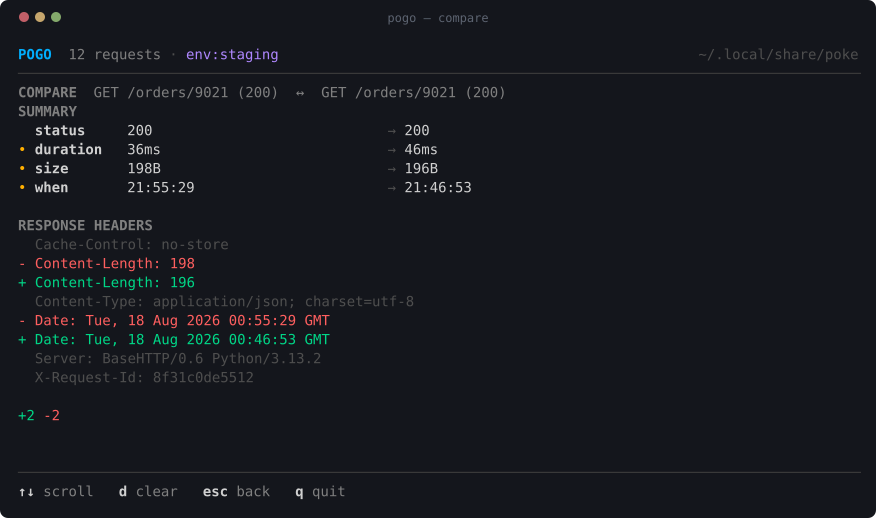
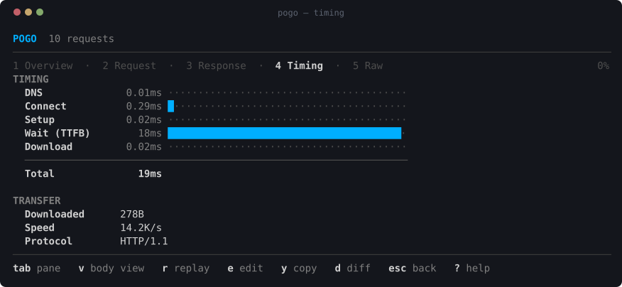
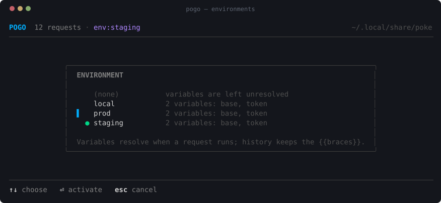
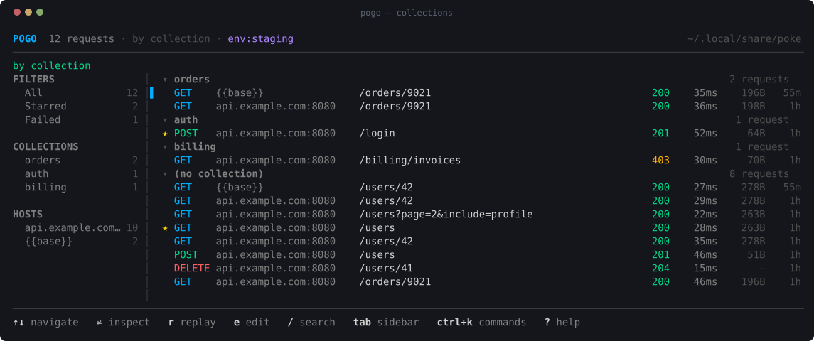
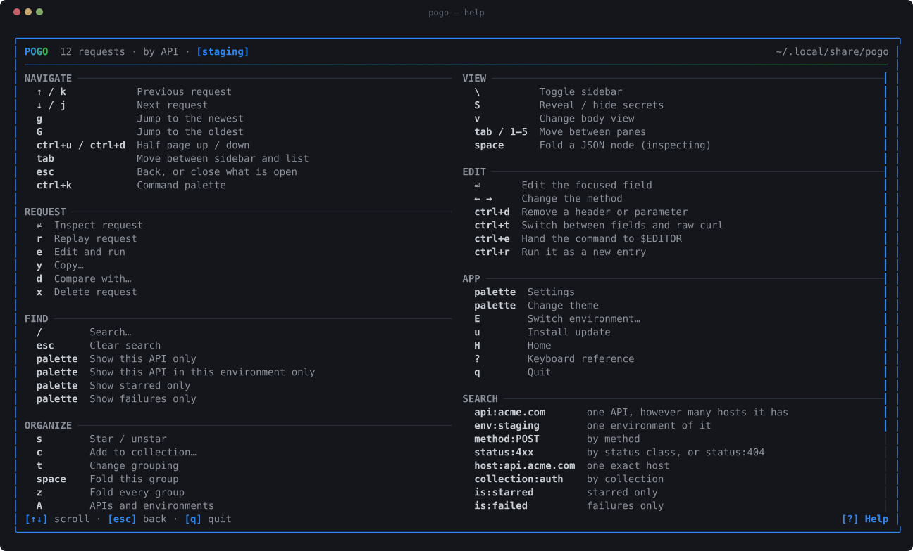

<div align="center">


**Poke your APIs. Pogo through your requests.**

[**rmpato.github.io/poke**](https://rmpato.github.io/poke)

[](https://github.com/rmpato/poke/actions/workflows/ci.yml)
[](https://pkg.go.dev/github.com/rmpato/poke/cmd/poke)
[](LICENSE)


</div>

---

Your shell remembers the *command*. It does not remember the response, the
status, how long it took, or which of the six nearly identical `curl` lines in
your history was the one that worked.

**`poke`** is curl with a memory. Type it where you would have typed curl:

```bash
poke https://api.example.com/users
```

Same output, same flags, same exit code — your arguments go to the real curl
binary. It just also writes down what happened.

**`pogo`** is what makes that worth having:

```bash
pogo
```



You never saved anything. You never named a collection. It was just there.



## Install

```bash
curl -fsSL https://raw.githubusercontent.com/rmpato/poke/main/install.sh | sh
```

Or with Go:

```bash
go install github.com/rmpato/poke/cmd/poke@latest
go install github.com/rmpato/poke/cmd/pogo@latest
```

Or from source: `git clone https://github.com/rmpato/poke && cd poke && make install`

You need `curl` on your PATH. That is the only runtime dependency, and it is
already on your machine. Update later with `poke --update`.

## poke

> curl, with a memory.

A wrapper, not a reimplementation. Every flag works, piping works, `-o` works,
`-v` works, exit codes match, and your scripts do not notice the difference.

```bash
poke -sSL https://example.com | jq .
poke -X DELETE https://api.example.com/users/41
poke -F upload=@photo.jpg https://api.example.com/files
poke --poke-no-capture https://api.example.com/secret   # run without recording
```

Capture rides on side channels that leave curl alone — `-D` for response
headers, a tee for the body, `--write-out` for timings. The two behaviors curl
changes when its output is a pipe (the progress meter, and its refusal to dump
binary into your terminal) are deliberately restored, so wrapping is invisible.
[How that works](docs/architecture.md).

## pogo

> the last hundred requests you made, made useful.

**Find it.** `/` for free text, or `method:POST`, `status:4xx`,
`host:api.example.com`, `collection:auth`, `is:starred`, `is:failed`.



**Read it.** Request and response, headers, query parameters, bodies — with a
JSON tree you can fold, and secrets masked until you ask.



**Change it and run it.** `e` opens the request as fields — method, URL, query,
headers, body. `ctrl+r` runs it as a **new** entry; the original is never
touched.



Edits are applied to your original command rather than regenerating one, so a
request carrying `--cacert`, `--resolve` or `-k` keeps every one of those
options when you change a header. `ctrl+t` shows the exact command it will run.

**See what changed.** `d` on two responses. JSON-aware: reordered keys and
reformatted whitespace are not differences, changed values are — and response
headers are diffed too.



**See where the time went.** Straight from curl's own instrumentation. Nothing
is estimated; if your curl cannot report it, pogo says so.



## Keep secrets out of your history

Write the request with variables and it runs against real values while your
history stores the braces:

```bash
poke -H "Authorization: Bearer {{token}}" '{{base}}/users/42'
```

curl gets the token. `history.jsonl` gets `{{token}}`. A replay months later
resolves it again — against whatever the variable holds *then*, not the expired
value you captured.



`E` switches environment; replay the same request against staging and production
and press `d` to see exactly how they differ.
[Environments and variables](docs/environments.md).

## Organize without filing

History gets noisy. `t` cycles grouping — chronological, by host, by collection.
`s` stars what matters, `c` files a request under a name.



## Bring in what the browser did

Devtools → Network → *Save all as HAR*, then:

```bash
pogo --import-har ~/Downloads/api.example.com.har
```

Every request arrives with its headers and body, as a curl command you can
inspect, edit and replay. The short path from "it works in the browser but not
from my terminal" to a diff of the two.

## Why not just shell history?

```bash
history | grep curl
```

finds the command you typed. It does not tell you:

| | shell history | pogo |
|---|---|---|
| the command | ✅ | ✅ |
| what came back | ❌ | ✅ |
| status code | ❌ | ✅ |
| how long it took | ❌ | ✅ |
| where the time went | ❌ | ✅ |
| search by status, host or collection | ❌ | ✅ |
| replay | retype it | `r` |
| edit and replay | retype it | `e` |
| compare two responses | ❌ | `d` |

pogo is HTTP-aware history for your terminal. That is all it is trying to be.

## Keyboard



`?` in the app, or [the full list](docs/keybindings.md).

## Storage and security

History lives in `~/.local/share/poke` (or `$XDG_DATA_HOME/poke`, or
`$POKE_HOME`) as append-only JSONL plus payload files. Directory `0700`, files
`0600`, nothing encrypted. Your requests never leave the machine.

**Request headers routinely carry credentials, and by default poke stores them
as sent.** Your history file will contain bearer tokens, cookies and API keys in
plain text. That is a trade-off, not an accident: stripping them would make
replay silently fail to authenticate. pogo masks secrets on screen; the file on
disk holds the real thing.

Three ways to change that, in increasing order of strength:

```bash
POKE_REDACT=store poke ...          # strip secrets before writing
poke --poke-no-capture ...          # do not record this one at all
poke -H "Authorization: Bearer {{token}}" '{{base}}/me'   # never capture it in the first place
```

Per-host rules let production and localhost have different answers. Read
[docs/security.md](docs/security.md) before pointing this at production
credentials. It is short and it does not hedge.

### Updates

poke asks GitHub once a day whether a newer release exists, only from an
interactive terminal, and only ever prints a line. Installing is `poke --update`,
or `u` and a confirmation in pogo. The check runs detached so it never delays a
request, downloads are verified against the published checksums, and
`POKE_NO_UPDATE_CHECK=1` turns it off.

## Architecture

```
   poke <curl args> ──▶ curlargs ──▶ runner ──▶ the real curl
                        (metadata)   (execute + capture)
                                        │
                                     capture ──▶ store  (JSONL + blobs, local)
                                        ▲          │
                                        │          ▼
                          pogo replays ─┘         tui
```

Both binaries share one execution path, so a replay is the same code running the
same argv — not a reconstruction of it. Storage knows nothing about the UI, the
UI never touches the filesystem, and the curl layer is testable without a
network.

Go, [Bubble Tea](https://github.com/charmbracelet/bubbletea),
[Lip Gloss](https://github.com/charmbracelet/lipgloss), Bubbles. No database, no
cgo, no daemon. [Details](docs/architecture.md).

Everything except the two commands lives under `internal/`, deliberately: poke
is a tool, not a library, and a package nobody can import is a package nobody
depends on. Command docs:
[poke](https://pkg.go.dev/github.com/rmpato/poke/cmd/poke) ·
[pogo](https://pkg.go.dev/github.com/rmpato/poke/cmd/pogo).

## Development

```bash
make          # build both binaries into ./bin
make check    # gofmt, vet, test, race — the same gates CI runs
make help     # everything else
```

Tests run the real curl against local `httptest` servers; nothing touches the
public internet. See [CONTRIBUTING.md](CONTRIBUTING.md) and the
[runbooks](docs/runbooks/) for releasing, regenerating the screenshots, and
triaging a "poke behaves differently from curl" report.

## Roadmap

Shipped since the first release:

- [x] structured request editor — method, URL, query, headers, body
- [x] collections, and grouping by them
- [x] environments and `{{variables}}`, resolved at run time
- [x] HAR import from browser devtools
- [x] response **header** diffing, not only bodies
- [x] per-host redaction rules
- [x] self-update with a daily, opt-out release check

Ideas, not promises, roughly in the order they would be useful:

- [ ] export a collection as a runnable script, or back out to HAR
- [ ] chained requests: use a value from one response in the next
- [ ] a `--diff` flag on `pogo` for scripting comparisons in CI
- [ ] response body search (`body:out_of_stock`), which needs an index
- [ ] request/response size and timing trends per endpoint
- [ ] `.pokerc` per project, so a repo can carry its own environment

If you want something on this list, an issue describing the moment you wanted it
is worth more than a feature request.

## License

MIT — see [LICENSE](LICENSE).
